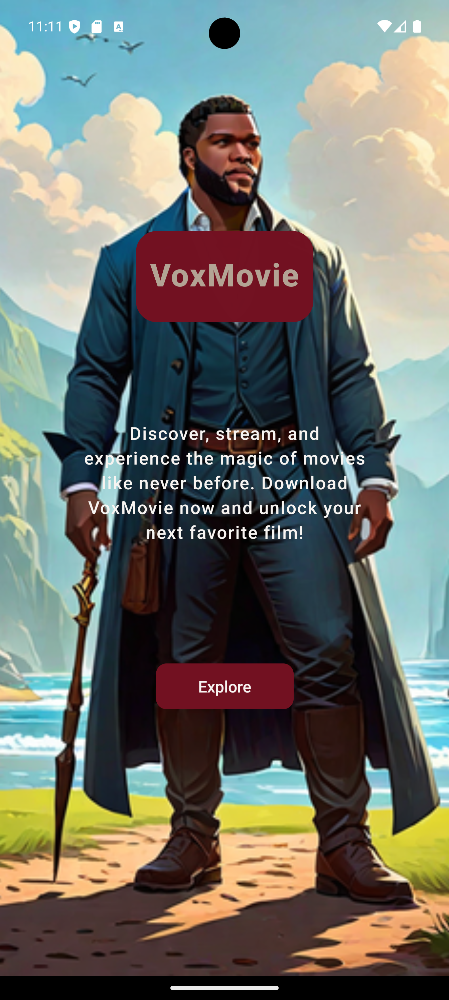
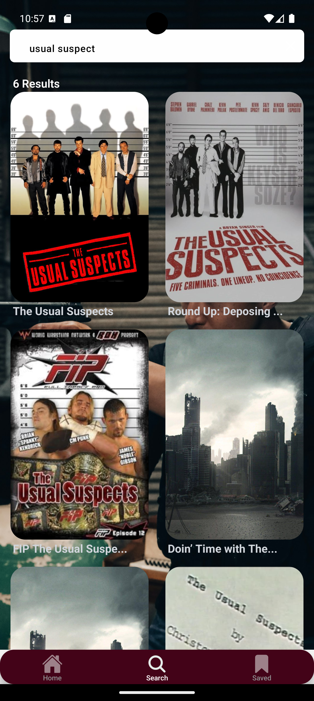
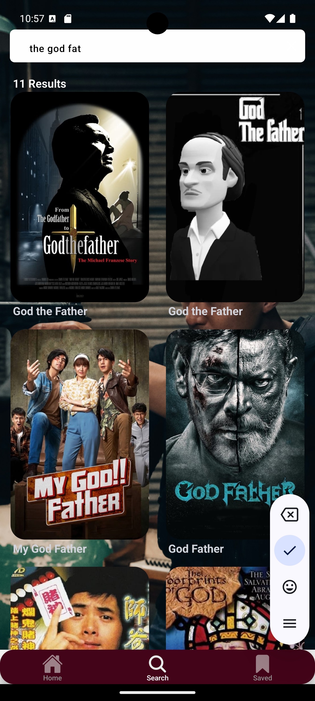

<h1>VoxMovie App Project</h1>

VoxMovie is your ultimate movie discovery app, connecting you to a vast library of films from around the world.
With VoxMovie app, you'll never run out of great movies to watch! 
In this project we use a movie APIs that provide comprehensive movie-related information.
 We use the api endpoints to fetch movie data. 🎬🍿

<h1></h1>
<h1>VoxMovie Key Features include</h1>

•	Personalized Recommendations: Get movie suggestions tailored to your taste based on your viewing history and preferences. 
•	Search and Filter: Easily search for movies by title, genre, release year, and more. Use filters to narrow down your choices. 
•	Movie Details: Access detailed information about each movie, including cast, crew, synopsis, ratings, and reviews. 
•	Watchlist: Create and manage your watchlist to keep track of movies you want to watch. 
•	User Reviews: Read and write reviews to share your thoughts with other movie enthusiasts. 

<h1></h1>
<h1>VoxMovie Screen</h1>

This section would allow users to easily navigate through different screen, helping them find exactly the film they're looking for in the app based on their needs and interests. 

   
   <h1></h1>
   
   <h1></h1>
   
   <h1></h1>
    
    <h1></h1>
    
    <h1></h1>

<picture>
  <source media="(prefers-color-scheme: dark)" srcset="https://raw.githubusercontent.com/tobiasmeyhoefer/tobiasmeyhoefer/output/github-snake-dark.svg" />
  <source media="(prefers-color-scheme: light)" srcset="https://raw.githubusercontent.com/tobiasmeyhoefer/tobiasmeyhoefer/output/github-snake.svg" />
  
</picture>
